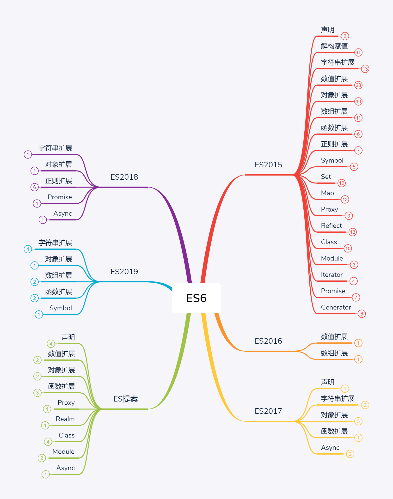
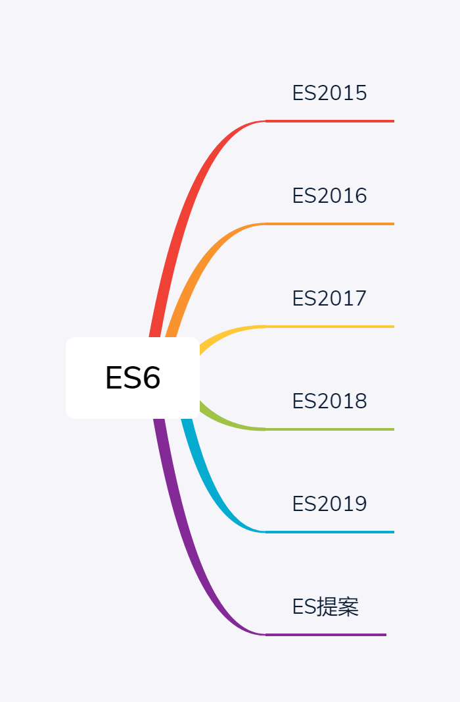

# ES6笔记
 + [1.ECMAScript6简介](#ECMAScript6简介)
    - [1.ECMAScript和JavaScript的关系]()
    - [2.ES6与ECMAScript2015的关系]()
    - [3.语法提案的批准流程]()
    - [4.ECMAScript的历史](#ECMAScript的历史)
    - [5.部署进度](#部署进度)
    - [6.Babel转码器](#Babel转码器)
    - [7.Traceur转码器](#Traceur转码器)
 + [2.let 和 const 命令](#let和const命令)
    - [1.let 命令](#let命令)
 + [3.变量的解构赋值](#变量的解构赋值)
    - [1.数组的解构赋值](#1.数组的解构赋值);
    - [2.对象的解构赋值](#2.对象的解构赋值);
    - [3.字符创的解构赋值](#3.字符串的解构赋值);
 + [4.字符串的扩展](#字符串的扩展)
    - [1.字符的Unicode表示法](#1.字符的Unicode表示法)
    - [4.字符串的遍历器接口](#4.字符串的遍历器接口)
    - [10.模板字符串](#10.模板字符串)
    - []()
 + [7.函数的扩展](#函数的扩展)
    - [1.函数参数的默认值](#1.函数参数的默认值)
    - []()
 + [8.数组的扩展](#数组的扩展)
    - [1.扩展运算符](#1.扩展运算符)
 + [9.对象的扩展](#对象的扩展)
    - [5.Object.assign()](#5.Object.assign())
    - [6.属性的可枚举性和遍历](#6.属性的可枚举性和遍历)
    - [7.Object.getOwnPropertyDescriptors()](#7.Object.getOwnPropertyDescriptors())
 + [14.Promise对象](#Promise对象)
    - [1.Promise的含义](#1.Promise的含义)
    - [2.基本用法](#2.基本用法)
    - []()
 + [22.Module的语法](#Module的语法)
    - [1.概述](#1.概述)
    - [2.严格模式](#2.严格模式)
    - [3.export命令](#3.export命令)
    - [4.import命令](#4.import命令)
    - [5.模块的整体加载](#5.模块的整体加载)
    - [6.export default命令](#6.export-default命令)
    - [7.export与import的复合写法](#7.export与import的复合写法)
    - [8.模块的继承](#8.模块的继承)
    - [9.跨模块常量](#9.跨模块常量)
    - [10.import()](#10.import())
    - []()
 + [30.Decorator装饰器](#Decorator装饰器)
    - [0.说明](#说明)
    - [1.类的装饰](#1.类的装饰)
    - [2.方法的装饰](#2.方法的装饰)
    - [3.为什么装饰器不能用于函数](#3.为什么装饰器不能用于函数)
    - [4.core-decorators.js](#4.core-decorators.js)
    - []()
 + []()
    - []()

## ECMAScript6简介

## ECMAScript的历史

  ECMAScript 1.0  1997 年发布
  ECMAScript 2.0  1998 年 6 月发布
  ECMAScript 3.0  1999 年 12 月

  3.0 版是一个巨大的成功,业界得到 广泛支持,成为标准,奠定 JavaScript 语言的基本语法,以后的版本完全继承。直到今天,初学者 开始学习 JavaScript,就是在学 3.0 版语法。

  2000 年,ECMAScript 4.0 开始酝酿。这个版本最后没有通过,但是大部分内容被 ES6 继承。因此,ES6 制定的起点其实是 2000 年。

  为什么 ES4 没有通过？因为这个版本太激进,对 ES3 做了彻底升级,导致 标准委员会 一些成员不愿接受。ECMA 的第 39 号技术专家委员会(Technical Committee 39,简称 TC39)负责制订 ECMAScript 标准,成员包括 Microsoft、Mozilla、Google 等大公司。

  2007 年 10 月,ECMAScript 4.0 版草案发布,本来预计次年 8 月发布正式版本。但是,各方对于是否通过这个标准,发生 严重分歧。以 Yahoo、Microsoft、Google 为首的大公司,反对 JavaScript 大幅升级,主张小幅改动；以 JavaScript 创造者 Brendan Eich 为首的 Mozilla 公司,则坚持当前的草案。

  2008 年 7 月,由于对于 下一版本 应该包括哪些功能,各方分歧太大,争论过于激烈,ECMA 开会决定,中止 ECMAScript 4.0 的开发,将其中涉及现有功能改善的一小部分,发布为 ECMAScript 3.1,而将其他激进的设想扩大范围,放入以后的版本,由于会议的气氛,该版本的项目代号起名为 Harmony(和谐)。会后不久,ECMAScript 3.1 就改名为 ECMAScript 5。

  2009 年 12 月,ECMAScript 5.0 版正式发布。Harmony 项目一分为二,一些较为可行的设想定名为 JavaScript.next 继续开发,后来演变成 ECMAScript 6；一些不是很成熟的设想,则被视为 JavaScript.next.next,在更远的将来再考虑推出。TC39 委员会的总体考虑是,ES5 与 ES3 基本保持兼容,较大的语法修正和新功能加入,将由 JavaScript.next 完成。当时,JavaScript.next 指的是 ES6,第六版发布以后,就指 ES7。TC39 的判断是,ES5 会在 2013 年的年中成为 JavaScript 开发的主流标准,并在此后五年中一直保持这个位置。

  2011 年 6 月,ECMAscript 5.1 版发布,并且成为 ISO 国际标准(ISO/IEC 16262:2011)。

  2013 年 3 月,ECMAScript 6 草案冻结,不再添加新功能。新的功能设想将被放到 ECMAScript 7。

  2013 年 12 月,ECMAScript 6 草案发布。然后是 12 个月的讨论期,听取各方反馈。

  2015 年 6 月,ECMAScript 6 正式通过,成为国际标准。从 2000 年算起,这时已经过去了 15 年。

 ### 部署进度

  各大浏览器的最新版本,对 ES6 的支持可以查看(kangax.github.io/es5-compat-table/es6/)。随着时间的推移,支持度已经越来越高,超过 90%的 ES6 语法特性都实现了。

  Node 是 JavaScript 的服务器运行环境(runtime)。它对 ES6 的支持度更高。除了那些默认打开的功能,还有一些语法功能已经实现,但默认没有打开。使用下面的命令,可以查看 Node 已经实现的 ES6 特性。

  > $ node --v8-options | grep harmony
  上面命令的输出结果,会因为版本的不同而有所不同。

  我(阮一峰)写了一个工具 ES-Checker,用来检查各种运行环境对 ES6 的支持情况。访问ruanyf.github.io/es-checker,可以看到您的浏览器支持 ES6 的程度。运行下面的命令,可以查看你正在使用的 Node 环境对 ES6 的支持程度。
  > $ npm install -g es-checker
  > $ es-checker

  #### Babel转码器
  (详见ES6)
  Babel 是一个广泛使用的 ES6 转码器,可以将 ES6 代码转为 ES5 代码,从而在现有环境执行。这意味着,可以用 ES6 的方式编写程序,又不用担心现有环境是否支持。
  
  下面是一个例子。

    // 转码前
    > input.map(item => item + 1);

    // 转码后
    > input.map(function (item) {
    >   return item + 1;
    > });

  上面的原始代码用 箭头函数,Babel 将其转为普通函数,就能在不支持箭头函数的 JavaScript 环境执行。

  `<h3>Babel配置文件.babelrc</h3>`
   Babel 的配置文件是.babelrc,存放在项目的根目录下。使用 Babel 的第一步,就是配置这个文件。 
   该文件用来设置转码规则和插件,基本格式如下。
   `{
     "presets": [],
     "plugins": []
   }` 

   `presets`字段设定转码规则,官方提供以下的规则集,你可以根 需要安装。 

    # 最新转码规则
   > $ npm install --save-dev babel-preset-latest 
    # react 转码规则
   > $ npm install --save-dev babel-preset-react 
    # 不同阶段语法提案的转码规则(共有4个阶段),选装一个
   > $ npm install --save-dev babel-preset-stage-0
   > $ npm install --save-dev babel-preset-stage-1
   > $ npm install --save-dev babel-preset-stage-2
   > $ npm install --save-dev babel-preset-stage-3

   然后,将这些规则加入`.babelrc`。

   `{
    "presets": [
      "latest",
      "react",
      "stage-2"
    ],
    "plugins": []
  }`

  注意,以下所有 Babel 工具和模块的使用,都必须先写好`.babelrc`。

  **命令行转码babel-cli**

  #### Traceur转码器

## let和const命令
  ### let命令
  **基本用法:**
  ES6 新增了let命令,用来声明变量。它的用法类似于var,但是所声明的变量,只在let命令所在的代码块内有效。

    `{
      let a = 10;
      var b = 1;
    }

    a // ReferenceError: a is not defined.
    b // 1 `

  **不存在变量提升**

  **暂时性死区**
   只要块级作用域内存在let命令,它所声明的变量就“绑定”(binding)这个区域,不再受外部的影响。

    `var tmp = 123;
    if (true) {
      tmp = 'abc'; // ReferenceError
      let tmp;
    }`
  
   总之,在代码块内,使用let命令声明变量之前,该变量都是不可用的。这在语法上,称为“暂时性死区”(temporal dead zone,简称 TDZ)。

  ### 
 
## 变量的解构赋值

  ### 1.数组的解构赋值
    *基本用法
    ES6允许按照一定模式,从 "数组" 和 "对象" 中提取值,对 变量 进行 赋值,这被称为解构。
    以前,为变量赋值,只能直接指定值。
    let a = 1;
    let b = 2;
    let c = 3;

    ES6允许
    let [a, b, c] = [1, 2, 3];

    上面代码表示,可以从数组中提取值,按照对应位置,对变量赋值。

    本质上,这种写法属于“模式匹配”,只要等号两边模式相同,左边变量就会被赋予对应的值。
  
  ### 2.对象的解构赋值
    解构不仅 数组,还可以 对象。
    let { foo, bar } = { foo: "aaa", bar: "bbb" };
    对象的解构 与 数组有一个重要不同。数组元素 按次序排列,变量取值由位置决定; 而对象 属性没有次序, 变量必须与属性同名,才能取到   正确的值。
  
    第一个例子,等号 左边 的两个变量次序,与等号右边 两个同名属性次序不一致,但是对取值完全没有影响。
    第二个例子,变量没有对应的同名属性,导致取不到值,最后等于undefined。
  
    变量名与属性名不一致,有特殊写法
    let { foo: baz } = {foo:'aaa',bar:'bbb'};
    let obj = {first:'hello',last:'world'};
    实际上说明,对象 解构赋值 是下面形式简写(参见《对象的扩展》一章)。
    也就是说,对象的解构赋值内部机制,先找到同名属性,然后再赋值给对应的变量。
    真正被赋值的是后者,而不是前者。
    let {foo:baz}={foo:'aaa',bar:'bbb'};
    foo是匹配模式,baz才是变量。
  
    与数组一样,解构也可以用于嵌套解构的对象。
    let obj={
      p:[
        'hello',
        {y:'world'}
      ]
    };
    let {p:[x,{y}]}=obj;
  
    var {x=3}={x:undefined};
    x // 3
    var {x=3}={x:null};
    x // null
  
    上面代码中,如果x属性等于null, 就不严格相等于 undefined, 导致默认值不会生效。
  
    如果解构失败,变量值等于 undefined。
    let {foo} = {bar: 'baz'};
    foo // undefined
  
    上面代码,等号左边对象foo属性,对应一个子对象。该子对象bar 属性,解构时会报错。原因很简单,因为foo这时等于 undefined,再取  子属性就会报错。
  
    let _tmp = {baz:'baz'};
 
## 字符串的扩展
  ### 1.字符的Unicode表示法


  ### 4.字符串的遍历器接口
    ES6 为字符串添加了遍历器接口（详见《**Iterator**》一章）,使得字符串可以被for...of循环遍历。
    除了遍历字符串,for···of遍历器最大的优点是可以识别大于0xFFFF的码点,传统的for循环无法识别这样的码点。

  ### 10.模板字符串
    传统的 JavaScript 语言,输出模板通常是字符串拼接。
    传统写法相当繁琐不方便,ES6 引入模板字符串解决这个问题。
    模板字符串（template string）是增强版的字符串,用反引号（`）标识。它可以当作普通字符串使用,也可以用来定义多行字符串,或者在字符串中嵌入变量。

## 函数的扩展
  ### 1.函数参数的默认值
    基本用法：
      ES6 之前,不能直接为函数的参数指定默认值,只能采用变通的方法。

## 数组的扩展
  ### 1.扩展运算符
   含义:
    扩展运算符(spread)是三个点（...）。它好比 rest 参数的逆运算,将一个数组转为用逗号分隔的参数序列。
    
    > console.log(...[1, 2, 3])
    > // 1 2 3

    > console.log(1, ...[2, 3, 4], 5)
    > // 1 2 3 4 5

    > [...document.querySelectorAll('div')]
    > // [<div>, <div>, <div>]
 
   该运算符主要用于函数调用。

## 对象的扩展

### 5.Object.assign()
更容易地解析异步数据,我们已经习惯了在开发流程中使用的工具。您可以看到一个增量异步映射/减少承诺。
**基本用法**\
(往 第一个 对象 参数中 深拷贝 参数)
`Object.assign`方法的第一个参数是目标对象,后面的参数都是源对象。
   
**注意 :** 如果目标对象与源对象有同名属性,或多个源对象有同名属性,则后面的属性会覆盖前面的属性。
     (参考代码略,同名属性 前面的属性 会被 后面的属性 覆盖) 
1. 浅拷贝
2. 同名属性的替换
3. 数组的处理
  按 索引替换
    > Object.assign([1, 2, 3], [4, 5])
4. 取值函数的处理

**常见用途**


**如果**只有一个参数,`Object.assign`会 直接返回 该参数。
> const obj = {a: 1};
> Object.assign(obj) === obj // true 
**如果**该参数 不是对象,则会先转成对象,然后返回。
`typeof Object.assign(2) // "object"` 
**由于**`undefined`和`null`无法转成对象,所以如果它们作为参数,就会报错。
`Object.assign(undefined) // 报错`
`Object.assign(null) // 报错` 
**如果**非对象参数出现在源对象的位置(即非首参数),那么处理规则有所不同。首先,这些参数都会转成对象,如 无法转成对象,就会跳过。这意味着,如果`undefined`和`null`不在首参数,就不会报错。
> let obj = {a: 1};
> Object.assign(obj, undefined) === obj // true
> Object.assign(obj, null) === obj // true 
**其他类型的值**（即数值、字符串和布尔值）不在首参数,也不会报错。但是,除了字符串会以数组形式,拷贝入 标对象,其他值都不会产生效果。 
`const v1 = 'abc';`
`const v2 = true;`
`const v3 = 10;`
`const obj = Object.assign({}, v1, v2, v3);`
`console.log(obj); // { "0": "a", "1": "b", "2": "c" }` 
上面代码中,`v1`、`v2`、`v3`分别是`字符串`、`布尔值`和`数值`,结果`只有字符串`合入目标对象(以字符数组 形式),`数值和布尔值都会被忽略`。**这是因为只有字符串的包装对象,会产生可枚举属性。** 
`Object(true) // {[[PrimitiveValue]]: true}`
`Object(10)  //  {[[PrimitiveValue]]: 10}`
`Object('abc') // {0: "a", 1: "b", 2: "c", length: 3, [[PrimitiveValue]]: "abc"}`

上面代码中,`布尔值`、`数值`、`字符串`分别转成对应的`包装对象`,可以看到它们的`原始值`都在包装对象的内 属性[[PrimitiveValue]]上面,这个属性是**不会被`Object.assign`拷贝**的。只有字符串的包装对象,会产生 枚举的实义属性,那些属性则会被拷贝。 
`Object.assign`拷贝的属性是有限制的,只拷贝源对象的`自身属性`（不拷贝继承属性）,也不拷贝不可枚举的属 (`enumerable: false`)。 
> Object.assign({b: 'c'},
>   Object.defineProperty({}, 'invisible', {
>     enumerable: false,
>     value: 'hello'
>   })
> )
> // { b: 'c' } 
上面代码中,`Object.assign`要拷贝的对象只有一个不可枚举属性`invisible`,这个属性并没有被拷贝进去。 
属性名为 `Symbol` 值的属性,也会被`Object.assign`拷贝。
`Object.assign({ a: 'b' }, { [Symbol('c')]: 'd' })`
`// { a: 'b', Symbol(c): 'd' }` 
   
***注意点***
（1）浅拷贝
  `Object.assign`方法实行的是`浅拷贝`,而不是深拷贝。也就是说,如果源对象某个属性的值是对象,那么目标 象拷贝得到的是这个对象的引用。
  `Object.assign`拷贝得到的是这个`对象的引用`。这个对象的`任何变化`,都会反映到目标对象上面。
（2）同名属性的替换
  对于嵌套的对象,一旦遇到同名属性,`Object.assign`的处理方法是替换,而不是添加。
（3）数组的处理
  `Object.assign`可以用来处理数组,但是会把数组视为对象。
（4）取值函数的处理
  `Object.assign`只能进行值的复制,如果要复制的值是一个取值函数,那么将求值后再复制。
  `Object.assign`不会复制 取值函数,只会拿到值以后,将这个值复制过去。 
***常见用途***
1. 为对象添加属性
2. 为对象添加方法
3. 克隆对象
4. 合并多个对象
5. 为属性指定默认值 
  
### 6.属性的可枚举性和遍历
  **可枚举性**
  对象的每个属性都有一个描述对象（`Descriptor`）,用来控制该属性的行为。`Object.getOwnPropertyDescriptor`方法可以获取该属性的描述对象。
  `let obj = { foo: 123 };`
  `Object.getOwnPropertyDescriptor(obj, 'foo')`
  {
    value: 123,
    writable: true,
    enumerable: true,
    configurable: true
  }
  描述对象的`enumerable`属性,称为"可枚举性",如果该属性为`false`,就表示某些操作会忽略当前属性。
  目前,有四个操作会忽略`enumerable`为`false`的属性。
    + `for...in`循环：只遍历对象自身的和继承的可枚举的属性。
    + `Object.keys()`：返回对象自身的所有可枚举的属性的键名。
    + `JSON.stringify()`：只串行化对象自身的可枚举的属性。
    + `Object.assign()`： 忽略enumerable为false的属性,只拷贝对象自身的可枚举的属性。
  
  这四个操作之中,前三个是 ES5 就有的,最后一个`Object.assign()`是 ES6 新增的。
  其中,只有`for...in`会返回继承的属性,其他三个方法都会忽略继承的属性,只处理对象自身的属性。
  实际上,引入“可枚举”（enumerable）这个概念的最初目的,就是让某些属性可以规避掉for...in操作,不然所有内部属性和方法都会被遍历到。
  比如,对象原型的`toString`方法,以及数组的`length`属性,就通过“可枚举性”,从而避免被for...in遍历到。

  `toString`和`length`属性的`enumerable`都是`false`,因此`for...in`不会遍历到这两个继承自原型的属性。

  另外,ES6 规定,所有 `Class` 的`原型的方法`都是不可枚举的。

  总的来说,操作中引入继承的属性会让问题复杂化,大多数时候,我们只关心对象自身的属性。所以,尽量不要用`for...in`循环,而用`Object.keys()`代替。

  **属性的遍历**
  ES6 一共有 5 种方法可以遍历对象的属性。
  （1）for...in
    for...in循环遍历对象自身的和继承的可枚举属性（不含 Symbol 属性）。
  （2）Object.keys(obj)
    Object.keys返回一个数组,包括对象自身的（不含继承的）所有可枚举属性（不含 Symbol 属性）的键名。
  （3）Object.getOwnPropertyNames(obj)
    Object.getOwnPropertyNames返回一个数组,包含对象自身的所有属性（不含 Symbol 属性,但是包括不可枚举属性）的键名。
  （4）Object.getOwnPropertySymbols(obj)
    Object.getOwnPropertySymbols返回一个数组,包含对象自身的所有 Symbol 属性的键名。
  （5）Reflect.ownKeys(obj)
    `Reflect.ownKeys`返回一个数组,包含对象自身的所有键名,不管键名是 Symbol 或字符串,也不管是否可枚举。

  以上的 5 种方法遍历对象的键名,都遵守同样的属性遍历的次序规则。

  + 首先遍历所有数值键,按照数值升序排列。
  + 其次遍历所有字符串键,按照加入时间升序排列。
  + 最后遍历所有 Symbol 键,按照加入时间升序排列。

### 7.Object.getOwnPropertyDescriptors()
  前面说过,`Object.getOwnPropertyDescriptor`方法会返回某个对象属性的描述对象（descriptor）。ES2017 引入了Object.getOwnPropertyDescriptors方法,返回指定对象所有自身属性（非继承属性）的描述对象。
  `Object.getOwnPropertyDescriptors`方法返回一个对象,所有原对象的属性名都是该对象的属性名,对应的属性值就是该属性的描述对象。
  该方法的实现非常容易。
  该方法的引入目的,主要是为了解决`Object.assign()`无法正确拷贝`get`属性和`set`属性的问题。

## Promise对象
### 1.Promise的含义
  所谓`Promise`,简单说就是一个`容器`,里面保存着某个`未来才会结束的事件`（通常是一个`异步操作`）的结果。从语法上说,Promise 是一个`对象`,从它可以`获取异步操作的消息`。Promise 提供`统一API`,各种异步操作都可以用同样的方法进行处理。

  **`Promise对象`两个特点**
  （1）`对象的状态不受外界影响`。Promise对象代表一个异步操作,有`三种状态`：`pending(进行中)`、`fulfilled(已成功)`和`rejected(已失败)`。只有异步操作的`结果`,可以`决定`当前是哪一种状态,任何`其他操作都无法改变`这个状态。这也是Promise这个名字的由来,它的英语意思就是“承诺”,表示其他手段无法改变。
  （2）`一旦状态改变,就不会再变`,`任何时候`都可以得到这个结果。`Promise`对象的`状态改变`,`只有两种可能`：
    ①从
      `pending`(prep. 在…期间；直到…时为止；在等待…之际; v. 待定；悬而不决（pend的ing形式）; 挂起)
    变为
      `fulfilled`(v. 实现（fulfill的过去分词）；履行；满足; adj. 满足的；十分愉快的)
    ②和从
      `pending`
    变为
      `rejected`(v. 拒绝,驳回（reject的过去分词形式）; adj. 被拒的；不合格的)。
    只要这两种情况发生,`状态就凝固`了,不会再变了,会一直保持这个结果,这时就称为 `resolved（已定型）`。如果改变已经发生了,你再对Promise对象添加回调函数,也会立即得到这个结果。这与事件（Event）完全不同,事件的特点是,如果你错过了它,再去监听,是得不到结果的。
  
  **注意**为了行文方便,本章后面的
  `resolved`(已解决；决定；分解；转变（resolve的过去分词）;adj. 下定决心的；已解决的；断然的)
  统一只指`fulfilled`状态,不包含`rejected`状态。
  
  有了`Promise`对象,可将`异步操作`以`同步操作`的`流程表达`出来,`避免`层层嵌套的回调函数。此外,`Promise`对象提供`统一接口`,使得`控制异步操作`更加容易。

  **Promise缺点**
  首先,`无法取消`Promise,一旦新建它就会立即执行,无法中途取消。
  其次,如不设回调函数,Promise内部抛出的错误,不会反应到外部。
  第三,当处于pending状态时,无法得知目前进展到哪一个阶段（刚刚开始还是即将完成）。
  
  **如果某些事件不断地反复发生,一般来说,使用 `Stream` 模式是比部署`Promise`更好的选择。**

### 2.基本用法
  ES6 规定,`Promise`对象是一个`构造函数`,用来生成Promise实例。
  下面代码创造了一个Promise实例。
  const promise = new Promise(function(resolve, reject) {
    // ... some code

    if (/* 异步操作成功 */){
      resolve(value);
    } else {
      reject(error);
    }
  });
  
  `Promise构造函数`接受一个`函数`作为参数,该函数的两个参数分别是`resolve`和`reject`。它们是两个函数,由 `JavaScript 引擎提供`,不用自己部署。

  `resolve函数`的作用是,将Promise对象的状态从“未完成”变为“成功”（即从 pending 变为 resolved）,在异步操作成功时调用,并将异步操作的结果,作为参数传递出去;
  `reject函数`的作用是,将Promise对象的状态从“未完成”变为“失败”（即从 pending 变为 rejected）,在异步操作失败时调用,并将异步操作报出的错误,作为参数传递出去。

### 3.Promise.prototype.then()
  `Promise`实例具有`then`方法,也就是说,then方法是定义在原型对象Promise.prototype上的。它的作用是为 Promise 实例添加状态改变时的回调函数。前面说过,then方法的`第一个参数`是`resolved状态`的回调函数,`第二个参数`（可选）是`rejected状态`的回调函数。
  then方法`返回`的是一个`新的Promise实例`（注意,不是原来那个Promise实例）。因此可以采用链式写法,即then方法后面再调用另一个then方法。

## Module的语法
### 1.概述
  历史上,`JavaScript` 一直没有模块(module)体系,无法将一个大程序拆分成互相依赖的小文件,再用简单的方法拼装起来。其他语言都有这项功能,比如`Ruby`的`require`、`Python`的`import`,甚至就连 `CSS` 都有`@import`,但是 `JavaScript` 任何这方面的支持都没有,这对开发大型的、复杂的项目形成了巨大障碍。

  ES6 之前,`社区制定`一些`模块加载方案`.最主要的有 `CommonJS` 和 `AMD` 两种。前者用于服务器,后者用于浏览器。
  ES6 在`语言标准的层面`上,实现了模块功能,而且实现得相当简单,完全可以取代`CommonJS`和`AMD`规范,成为浏览器和服务器`通用`的模块解决方案。

  ES6 模块 设计思想是尽量的`静态化`,使得`编译时就能确定模块的依赖关系`,以及`输入和输出的变量`。CommonJS 和 AMD 模块,都只能在`运行时`确定这些东西。比如,CommonJS 模块就是对象,输入时必须查找对象属性。

  由于 ES6 模块是编译时加载,使得静态分析成为可能。有了它,就能进一步拓宽 JavaScript 的语法,比如引入宏（macro）和类型检验（type system）这些只能靠静态分析实现的功能。

### 2.严格模式
  ES6 的模块自动采用严格模式,不管你有没有在模块头部加上`"use strict"`;。
  严格模式主要有以下`限制`:
  + 变量必须声明后再使用
  + 函数的参数不能有同名属性,否则报错
  + 不能使用with语句
  + 不能对只读属性赋值,否则报错
  + 不能使用前缀 0 表示八进制数,否则报错
  + 不能删除不可删除的属性,否则报错
  + 不能删除变量delete prop,会报错,只能删除属性delete global[prop]
  + eval不会在它的外层作用域引入变量
  + eval和arguments不能被重新赋值
  + arguments不会自动反映函数参数的变化
  + 不能使用arguments.callee
  + 不能使用arguments.caller
  + 禁止this指向全局对象
  + 不能使用fn.caller和fn.arguments获取函数调用的堆栈
  + 增加了保留字（比如protected、static和interface）

  以上限制,模块必须遵守。由于`严格模式`是 `ES5` 引入的,不属于 ES6,所以请参阅相关 ES5 书籍,本书不再详细介绍。

  其中,尤其需要注意`this`的限制。ES6 模块之中,顶层的this指向undefined,即不应该在顶层代码使用this。

### 3.export命令
  模块功能主要由两个命令构成：`export`和`import`。
  `export`命令用于`规定模块的对外接口`;
  `import`命令用于`输入其他模块提供的功能`。
  `export`命令除了输出变量,还可以输出`函数`或`类(class)`

  通常情况下,`export`输出的`变量`就是`本来名字`,但是可以使用`as`关键字重命名。

  需要特别注意的是,`export`命令规定的是`对外接口`,必须与`模块内部变量`建立一一`对应`关系。
  
  同样的,`function`和`class`的输出,也必须遵守这样的写法.

  **★动态绑定**
  另外,`export`语句输出的接口,与其对应的值是`动态绑定`关系,即通过该接口,可以取到模块`内部实时`的值。
  > export var foo = 'bar';
  > setTimeout(() => foo = 'baz', 500);
  上面代码输出变量foo,值为bar,500 毫秒之后变成baz。

  与 CommonJS 规范完全不同。CommonJS 模块输出的是`值的缓存`,不存在动态更新,详见下文《Module 的加载实现》一节。

  最后,export命令可以出现在`模块的任何位置`,只要处于`模块顶层`就可以。如果处于`块级作用域内,就会报错`,下一节的import命令也是如此。这是因为处于`条件代码块中,就无法做静态优化`,违背了 ES6 模块的设计初衷。

### 4.import命令
  使用`export`命令定义了模块的`对外接口`以后,其他`JS文件`就可以通过`import`命令加载这个模块。

  `import`命令接受一对`大括号{...}`,里面指定要从其他模块导入的变量名。`大括号里面的变量名`,必须与`被导入模块(xxx.js)对外接口的名称相同`。
  
  如果想为输入的变量`重新取名`,import命令要使用`as`关键字,将输入的变量重命名。
  > import { lastName as surname } from './xxx.js';

  import命令输入的变量都是`只读`的,因为它的本质是输入接口。也就是说,`不允许`在加载模块的脚本里面,`改写接口`。

  脚本加载了变量a,对其重新赋值会报错,因为a是一个只读的接口。但是,如果a是一个对象,改写a的属性是允许的。
  a的属性可以成功改写,并且`其他模块也可以读到改写后的值`。不过,这种写法`很难查错`,`建议`凡是输入的变量,都当作`完全只读`,`轻易不要改变属性`。

  `import`后面的`from`指定模块文件的位置,可以是相对路径,也可以是绝对路径,`.js`后缀可以省略。`如果`只是模块名,没有路径,那么`必须`有配置文件,告诉 JavaScript 引擎该模块的位置。

  **注意**`import`命令具有提升效果,会提升到整个模块的头部,首先执行。
  `import`的执行`早于`函数的调用。这种行为的本质是,import命令是`编译阶段执行`的,在`代码运行之前`。
  
  **由于**import是`静态执行`,所以不能使用`表达式`和`变量`以及`if结构`,这些只有在`运行时才能得到结果的语法结构`。

  最后,import语句会`执行`所加载的模块,如果`多次重复`执行同一句import语句,那么`只执行一次`,而不会执行多次。import语句是 Singleton 模式。

### 5.模块的整体加载
  除了指定加载某个输出值,还可以使用整体加载,即用星号`*`指定一个对象,所有输出值都加载在这个对象上面。
  > import * as circle from './circle';

### 6.export-default命令
  `export default`命令用于指定模块的`默认输出`。显然,一个模块`只能有一个`默认输出,因此export default命令只能使用一次。所以,import命令后面才`不用加大括号`,因为`只可能唯一对应`export default命令。

  本质上,export default就是输出一个叫做`default`的`变量或方法`,然后系统允许你为它取任意名字。

  如果想在一条import语句中,同时输入默认方法和其他接口,可以写成下面这样。

  > import _, { each, each as forEach } from 'lodash';

### 7.export与import的复合写法
  如果在一个模块之中,先输入后输出同一个模块,import语句可以与export语句写在一起。
  `export { foo, bar } from 'my_module';`
  // 可以简单理解为
  `import { foo, bar } from 'my_module';`
  `export { foo, bar };`

  上面代码中,export和import语句可以结合在一起,写成一行。但需要**注意**的是,写成一行以后,foo和bar实际上`并没有被导入当前模块`,只是相当于`对外转发了这两个接口`,导致`当前模块不能直接使用foo和bar`。

  模块的接口改名和整体输出,也可以采用这种写法。
  // 接口改名
  `export { foo as myFoo } from 'my_module';`
  // 整体输出
  `export * from 'my_module';`

  默认接口的写法如下。
  `export { default } from 'foo';`

### 8.模块的继承
  模块之间也可以继承。

  假设有一个circleplus模块,继承了circle模块。
  // circleplus.js
  > export * from 'circle';
  > export var e = 2.71828182846;
  > export default function(x) {
  >   return Math.exp(x);
  > }

  上面代码中的`export *`,表示再输出circle模块的`所有属性和方法`。**注意**,`export *`命令会`忽略`circle模块的`default`方法。然后,上面代码又`输出`了`自定义`的`e变量`和`默认方法`。

### 9.跨模块常量
  本书介绍const命令的时候说过,const声明的常量只在当前代码块有效。如果想设置跨模块的常量（即跨多个文件）,或者说一个值要被多个模块共享,可以采用下面的写法。
  `具体见官方文档`

### 10.import()
  **简介**
  引擎处理`import`语句是在`编译时`,这时不会去分析或执行if语句,所以import语句放在if代码块之中毫无意义,因此会报句法错误,而不是执行时错误。也就是说,import和export命令`只能在模块的顶层`,不能在代码块之中（比如,在if代码块之中,或在函数之中）。(静态加载)
  
  这样的设计,固然`有利于编译器提高效率`,但也导致`无法在运行时加载模块`。在语法上,`条件加载就不可能实现`。如果import命令要取代 Node 的require方法,这就形成了一个障碍。因为`require是运行时加载模块`,import命令无法取代require的`动态加载`功能。(动态加载)

  因此,有一个提案,建议引入`import()`函数,完成动态加载。
  `import()`返回一个 `Promise` 对象。下面是一个例子。
  `详见官方文档`
  import()函数可以用在`任何地方`,不仅仅是模块,非模块的脚本也可以使用。它是`运行时执行`,也就是说,什么时候运行到这一句,也会加载指定的模块。另外,import()函数与所加载的模块`没有静态连接关系`,这点也是与import语句不相同。
  `import()`类似于`Node`的`require`方法,区别主要是`前者异步加载`,`后者同步加载`。
  
  **适用场合**
  （1）按需加载
  （2）条件加载
  （3）动态的模块路径
    `import()`允许模块路径`动态生成`:
    > import(f())
      > .then(...);

  **注意点**
  `import()`加载模块成功以后,这个模块会作为一个`对象`,当作`then方法的参数`。因此,可以使用对象解构赋值的语法,获取输出接口。
  > import('./myModule.js')
      .then(({export1, export2}) => {
        // ...·
      });
  上面代码中,`export1`和`export2`都是`myModule.js`的输出接口,可以解构获得。
  `default输出接口`||`具名(改名)输入的形式`
  **同时加载多个模块**(见官方文档)
  **`import()`也可用在`async`函数中**(见官方文档)

------

## Decorator装饰器
### 说明
<!-- 2019年12月5日 12:20:47 -->
`Decorator` 提案经过了`大幅修改`，目前还`没有定案`，不知道语法会不会再变。下面的内容完全依据以前的提案，已经有点过时了。等待定案以后，需要`完全重写`。

`装饰器（Decorator）`是一种与`类（class）`相关的语法，用来`注释或修改`类和类方法。许多面向对象的语言都有这项功能，目前有一个提案将其引入了 ECMAScript。

装饰器是一种函数，写成`@ + 函数名`。它可以放在类和类方法的定义前面。

### 1.类的装饰
装饰器可以用来装饰整个类。

**注意:** 装饰器对类的行为的改变，是代码`编译时`发生的，而不是在运行时。这意味着，装饰器能在编译阶段运行代码。也就是说，装饰器本质就是`编译时执行的函数`。

### 2.方法的装饰
装饰器不仅可以装饰类，还可以装饰类的属性。

一共可以接受三个参数：\
1. 装饰器第一个参数是`类的原型对象`，装饰器的本意是要“装饰”`类的实例`，但是这个时候实例还没生成，所以只能去装饰原型（这不同于类的装饰，那种情况时target参数指的是类本身）；
2. 第二个参数是所要装饰的`属性名`;
3. 第三个参数是该属性的`描述对象 => descriptor`。

```ts
// 类似于
Object.defineProperty(Person.prototype, 'name', descriptor);
```

`装饰器（readonly）`会修改 属性 的`描述对象（descriptor）`，然后 被修改的`描述对象再用来定义属性`.

**装饰器有注释的作用**
```ts
@Component({
  tag: 'my-component',
  styleUrl: 'my-component.scss'
})
export class MyComponent {
  @Prop() first: string;
  @Prop() last: string;
  @State() isVisible: boolean = true;

  render() {
    return (
      <p>Hello, my name is {this.first} {this.last}</p>
    );
  }
}
```

**同一个方法有多个装饰器，会像剥洋葱一样，先从外到内进入，然后由内向外执行。**
```js
function dec(id){
  console.log('evaluated', id);
  return (target, property, descriptor) => console.log('executed', id);
}

class Example {
    @dec(1)
    @dec(2)
    method(){}
}
// evaluated 1
// evaluated 2    !!!
// executed 2     !!!
// executed 1
```

**除了注释，装饰器还能用来类型检查。所以，对于类来说，这项功能相当有用。从长期来看，它将是 JavaScript 代码静态分析的重要工具。**

### 3.为什么装饰器不能用于函数
装饰器 只能 用于`类和类的方法`，不能 用于函数，因为存在`函数提升`
```js
var counter = 0;

var add = function () {
  counter++;
};

@add
function foo() {
}
```

上面的代码，意图是执行后counter等于 1，但是实际上结果是counter等于 0。因为函数提升，使得实际执行的代码是下面这样。

```js
@add
function foo() {
}

var counter;
var add;

counter = 0;

add = function () {
  counter++;
};
```

**总之，由于存在函数提升，使得装饰器不能用于函数。类是不会提升的，所以就没有这方面的问题。**

**另一方面，如果一定要装饰函数，可以采用高阶函数的形式直接执行。**

```js
function doSomething(name) {
  console.log('Hello, ' + name);
}

function loggingDecorator(wrapped) {
  return function() {
    console.log('Starting', this);
    const result = wrapped.apply(this, arguments);
    console.log('Finished');
    return result;
  }
}

const wrapped = loggingDecorator(doSomething);
```

### 4.core-decorators.js
core-decorators.js是一个第三方模块，提供了几个常见的装饰器，通过它可以更好地理解装饰器。


### 5.使用装饰器实现自动发布事件

---

# [ES6全部特性(图文并茂)](http://www.yyyweb.com/5318.html || http://www.yyyweb.com/5321.html)
整理时间：2019年12月10日 11:12:40

+ [前言](#前言)
+ [修正](#修正)
+ [ES6主要更新内容](#ES6主要更新内容)
+ [](#)
+ [](#)
+ [](#)

## 前言
以下提到的《ES6标准入门》统一使用《ES6》这个名称来代替，而最新的ES6版本也是截止到当前的ES2019

本文的知识点完全是参考或摘录[《ES6》](es6.ruanyifeng.com)里的语句，有部分语句为了方便理解和记忆，进行了相同意思的转义，同时对知识点进行归类划分。为了让大家能集中精力来记住这些特性，全文一句废话和题外话都没有，全部模块以笔记的形式进行书写，如果看得不是很惯建议对照[《ES6》](es6.ruanyifeng.com)的内容来学习。



## 修正
ES6是ECMA为JavaScript制定的第6个标准版本，相关历史可查看此章节[《ES6-ECMAScript6简介》](https://es6.ruanyifeng.com/#docs/intro)。

标准委员会最终决定，标准在 `每年6月` 正式发布并作为当年的正式版本，接下来的时间里就在此版本的基础上进行改动，直到下一年6月草案就自然变成新一年的版本，这样一来就无需以前的版本号，只要用年份标记即可。`ECMAscript 2015`是在`2015年6月`发布ES6的第一个版本。以此类推，`ECMAscript 2016`是ES6的第二个版本、 `ECMAscript 2017`是ES6的第三个版本。**ES6**既是一个历史名词也是一个泛指，含义是`5.1版本`以后的`JavaScript下一代标准`，目前涵盖了`ES2015`、`ES2016`、`ES2017`、`ES2018`、`ES2019`。

所以有些文章上提到的 ES7(实质上是ES2016)、ES8(实质上是ES2017)、ES9(实质上是ES2018)、ES10(实质上是ES2019)，实质上都是一些不规范的概念。从ES1到ES6，每个标准都是花了好几年甚至十多年才制定下来，你一个ES6到ES7，ES7到ES8，才用了一年，按照这样的定义下去，那不是很快就ES20了。用正确的概念来说ES6目前涵盖了ES2015、ES2016、ES2017、ES2018、ES2019。



## ES6主要更新内容
+ 表达式：声明、解构赋值
+ 内置对象：字符串扩展、数值扩展、对象扩展、数组扩展、函数扩展、正则扩展、Symbol、Set、Map、Proxy、Reflect
+ 语句与运算：Class、Module、Iterator
+ 异步编程：Promise、Generator、Async

## ES2015


## ES2016

## ES2017

## ES2018

## ES2019

