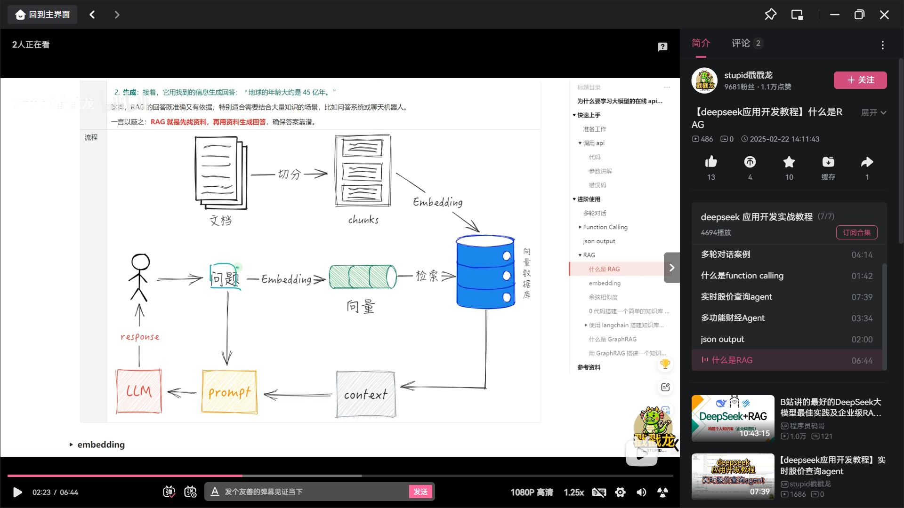
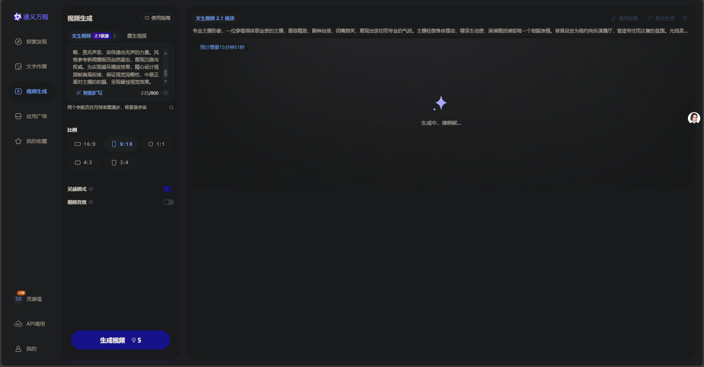
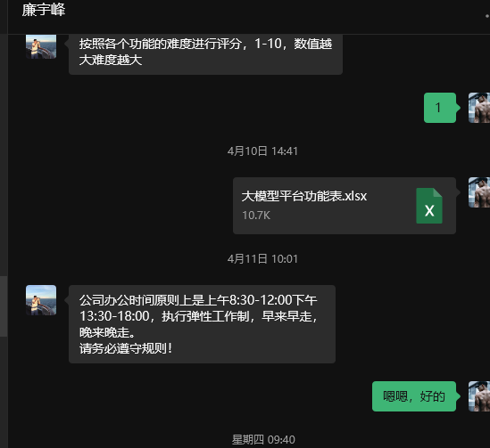

# 2025 年 2 月 5 日 11:44:57 周三 正月初八 年后开工第一天

## 工作周报

- 调试 数字人

  - 云服务器 训练(调研)

    - 导出 python 依赖
    - > pip freeze > {output_file}.txt
    - 如果是 @ file:// 格式的路径需要单独下载
      例如 colorama @ file:///home/conda/feedstock_root/build_artifacts/colorama_1733218098505/work
      <!-- @ file: 需要官网下载，不能直接 pip install -->
    - 安装依赖
      pip install -r {input_file}.txt

    - 本机测试依赖环境
      是否能跑训练？
    - 测试通过
      直接 把 Linux 环境 + 项目打包
      同时还得改 源码调用
      cuda 版本问题
      pytorch 版本问题

  - 嘴唇 替换不用 随机库
  - 暂停训练 断点继续训练

  - 浏览器如何收集 实时音频数据
    - [浏览器 语音转文字](https://developer.mozilla.org/zh-CN/docs/Web/API/Web_Speech_API/Using_the_Web_Speech_API)
    - 
    - [TTS 文字转语音]()
    - 根据文字 生成视频
      - dh_live
  - ## 画面 传输到 浏览器

* 上午 11 点开会工作安排

  - TOCC PC 货运物流 页面开发

    - 全路网
      http://localhost:8888/#/map/road-v2/home/full_fibre_network

      - 问题记录
        - 1. 左侧弹框 需求与设计稿不一致
          - 需求：货车流量、货运量（详情见原型）
          - 设计稿：只有货运量（详情见原型）
        - 2. Top3 没有颜色区分？

    - 流向
      http://localhost:8888/#/map/road-v2/home/traffic_flow_direction

      - 问题记录
        - 1. 流量列表 历史功能 交互逻辑？是否需要 日期选择？
        - 2. 是否有导出功能
        - 3. 流向展示的气泡位置？箭头是否需要？

    - 收费站
      http://localhost:8888/#/map/road-v2/home/freight_logistics/toll_station/volume_freight_traffic
    - 问题记录
      <!-- - 1. 中间地图 收费站坐标 -->
      <!-- - 2. 展示 车流量 还是 货运量？ -->
      - @张磊
        - ✔ 优先处理 1. 每个接口的返回至都增加了顶端指标
        - 2. ✔️ 查询货车车流量 TOP3 的收费站+货运量 TOP3 的收费站 和 查询货运物流 TOP3 县域 两个接口 增加了 lng lat
        - 3. ✔️ 所有 日期组件 改为单日
             日期查询 & 按照类型 更新指定 数据
             增加 loading 状态
      - 周六加班 2025 年 2 月 15 日 10:47:33
        1. 确定高速线路 和 名称匹配
        2. ✔️ 前端超时 调整为 3 => 10 分钟
        3. ✔️ 流向 添加 loading 状态
        4. ✔️ 流向 顶部指标
        5. ✔️ 收费站 fitbounds 适配
        6. 全路网 高速路 fitbounds 适配
        7. ✔️ 全路网 高速坐标 截取中间点
        8. charts 图表数据问题排查

- 2025 年 2 月 17 日 周一

  1. 大人和孩子都是 20 年终身么？
  2. 保费都退还么？
  3. 总结 各保险的基本规则
  4. 媳妇儿没买重疾，可以直接买医疗险？
     可以买百万医疗，不能买小病医疗
     小病医疗必须有主险，主险就是重疾险
  5. 年龄越小，参保费用越低

# 保险配置梳理

1. 我的保险配置

   - 重疾险(主险)
   - 升级 百万医疗

2. 宁宁的保险

   - 重疾险(主险)
   - 百万医疗
   - 小病医疗(需要主险)

3. 孩子的全险

- 重疾险(主险-起付条件: 重疾是一次性赔付)
  - 是否覆盖少儿高发疾病（如白血病、重症手足口病等）?
    医院写的话不会直接写白血病，属于血液病
  - 是否含轻/中症多次赔付?
    多次赔付 费率更高
  - 豁免条款?
    如果你给媳妇儿也投保了，附加了投保人豁免，也给孩子投保了，也加了投保人豁免，发生风险是豁免保费的（指轻度疾病或重大疾病）
- 百万医疗(附加险-起付条件: 费用 1W 以上，报销额度 100W 左右)
  - 是否包含外购药、质子重离子治疗等增值服务?
- 小病医疗(附加险: 弥补百万医疗的不足)
  - 覆盖小额住院/门急诊费用
  - 是否包含门诊、社区门诊（如感冒发烧、意外门诊）
  - 是否 0 免赔、报销比例 多少？
    100%？
- 意外险(附加险-起付条件: )
  - 10 岁以下儿童身故保额不超过 20 万（监管要求）（我理解是怕父母骗保）
  - 是否包含 烧烫伤、误食异物等少儿高发意外责任？

李峰: 少儿 360 优享 2

<!--
  一、您当前配置的合理性分析
  重疾险（主险）
  正确点：理解重疾险为“确诊即赔”的一次性给付型保险，符合核心功能15。
  待优化：
  保额建议至少50万（覆盖治疗+康复+家庭收入损失）15。
  需覆盖少儿高发疾病（如白血病、重症手足口病等），并关注是否含轻/中症多次赔付、豁免条款?
  46。

  百万医疗险（附加险）
  正确点：覆盖大额医疗费用（1万免赔额以上），保额100万以上合理56。
  待优化：
  优先选择“保证续保20年”的产品（如蓝医保、好医保），避免停售风险56。
  注意是否包含外购药、质子重离子治疗等增值服务56。

  小病医疗险（附加险）
  正确点：用于弥补百万医疗的1万免赔额，覆盖小额住院/门急诊费用合理14。
  待优化：
  明确是否含门诊责任（如感冒发烧、意外门诊）49。
  优先选择0免赔、报销比例100%的产品（如平安小神童意外医疗）1。

  意外险（附加险）
  正确点：覆盖意外身故/伤残及医疗费用14。
  待优化：
  10岁以下儿童身故保额不超过20万（监管要求）4。
  需包含烧烫伤、误食异物等少儿高发意外责任46 -->
  <!--
  二、需补全的关键保障
  少儿医保（必备基础）
  国家福利，每年约 200 元，报销 50%-80%基础医疗费用，且购买商业保险更便宜。
  优先级高于商业险，务必优先配置。

  专项补充（按需选择）
  高端医疗险：覆盖特需部/VIP 病房、私立医院，适合追求优质医疗资源的家庭。
  教育年金险：强制储蓄未来教育费用，适合预算充足的家庭。

  三、配置优先级与避坑建议
  配置顺序：
  少儿医保 → 百万医疗险 + 意外险 → 重疾险 → 小病医疗险 → 其他补充 145。

  避坑指南：

  避免“捆绑型保险”（如寿险+重疾+医疗），拆分购买性价比更高 24。
  健康告知需如实填写，否则可能拒赔 35。
  重疾险保额优先于保障期限，预算有限可选保 30 年（如大黄蜂系列）56。
 -->

- 2025 年 2 月 18 日 11:32:34

- 2025 年 2 月 19 日 14:19:39 周三

  - 如何写提示词

  - 如何用 ai 评价 ai
  - 工作流

- 手机退换机
  我说下我的观点，供你参考

  - 退货
    就说接受 500 的折价
    二手市场 看成色 大概在 75%-85%之间
    考虑到我们是 非人为因素损坏，接受 85%以上的折旧率。
    4000 \* 0.85 = 3400 元(最低接受 3400)
  - 故障影响：
    信号故障属于核心功能缺陷，需拆机维修（涉及主板/天线），二手回收价将再降低 20-30%。参考努比亚 Z60 Ultra 同类故障机型回收案例，估算当前残值约 2000-2500 元。

  * 最优处理建议
    1. 优先走正规售后流程
       立即要求官方售后出具故障检测报告，明确问题性质。
       若确认为硬件故障，首次维修后保留工单；若二次维修未解决，可依法要求退货（无需折价）。
    2. 协商折价退货话术
       向商家强调：“新机短期内出现重大故障，已影响使用信心，希望减少双方损失协商退机”。
       可提出折价 10-15%（即退款 3400-3600 元），高于二手回收价但低于维修成本，增加协商成功率。
    3. 备选方案：维修后转卖
       若商家拒绝退货，维修后通过闲鱼等平台出售。根据数据，维修记录会导致二手价降低约 30%，预计回收价约 2800 元（4000×70%）。

- 2025 年 2 月 22 日 16:12:14
  > openssl req -x509 -newkey rsa:4096 -keyout key.pem -out cert.pem -days 365 -nodes

## 2025 年 2 月 24 日 10:17:24 周一

- 9.30 - 10.30

  - 上午 9.30+ 到公司，早上未找到免费车位，停耀荣。
  - 签署保险合同
    到公司 阅读郭晓芳提供保险合同，发现手机号填错问题。

  - 微信看一看
    阅读 人民日报新闻: https://mp.weixin.qq.com/s/9SmxYuwrpJFbJbWwEcLXqQ
    通过 纳米 AI DS 满血 分析、提炼总结 文章内容

  - 打开 B 站

  - 询问宁宁的鼻炎状况

- 10.30 - 11.30

  - 联系中通快递 咨询快递状态
  - 阅读看一看文章
  - 整理微信收藏内容 增加 美体玉足标签

  * 钉钉周报
    梳理开发计划
    本周待办
    跟廉总微信沟通 STT API 事宜

  - 厕所解大手
  - 接水两杯

- 11.30 - 12.00
  挪车、热饭

- 12.00 - 13.30

  - [微信看一看 文章](https://mp.weixin.qq.com/s/UP6ZVBHXBn7GShFRsDTHGg)
    放弃拥有权 享受使用权
    女朋友就算做了天大的错事、和你的老婆也没有关系 🤷🏻‍♂️
  - 刷 B 站

- 13.30 - 14.30

  - 刷 B 站 找音乐

- 14.30 - 15.30

  - 看小说
  - 刷 B 站

- 15.30 - 16.30

  - ollama 部署本地 DeepSeek 大模型，搭建 本地知识库

  1. 验证部署
     浏览器访问 http://localhost:11434 显示"Ollama is running"即成功
     终端输入 `ollama list` 查看已安装模型

  - 本地知识库搭建方案
    方案 1: Dify + 私有知识库（推荐）

- 16.30 - 17.30

  - 调试 来都路前端二维项目
    1. 确认 巡视 功能注释逻辑
    2. 调整 轨迹回放 右侧窗口样式
       feat: 调整 轨迹回放窗口 右侧小窗口样式布局

- 17.30 - 18.30

  - 调试 来都路前端二维项目
    提交代码

  * 接到天猫客服电话 取消退货
  * 陈宁带孩子来接下班。和 陈宁沟通 下车点

- 18.30 - 18.50
  - 阅读看一看文章
    [JavaScript Map 比对象更香？](https://mp.weixin.qq.com/s/3yUbtw2oI59CBmacZTHKzA)

## 2025 年 2 月 25 日 09:38:04 周二

- 9.30 - 10.30
  停车
  换水
  接水
  调试 空气加湿器，更换滤芯

  - [图灵云 STT API](https://www.tulingyun.com/docs.html)

- 10.30 - 11.30
  厕所解大手？
  调试 图灵 STT 接口
  与售后沟通 z60U 领先版 手机延期交付问题

- 11.30 - 12.00
  图灵 STT 接口 已对接 返回 200，但是无法正常识别语音
  另外再官网提供的测试页面 也是如此，无法识别语音。

- 12.00 - 13.30
  吃饭
  刷 B 站 抖音

- 13.30 - 14.30

  - 继续调试 图灵 STT
    官网 录音无法成功，但是 上传语音可以

  - 接到廉总电话 讨论关于 大模型本地实时知识库的需求
    - 需求总结 需要大模型实时播报 私有知识库内容
    - 问题提炼: 本地部署 DeepSeek-R1 大模型 读取 实时私有知识库内容
    - 举例说明: 我提供大模型 实时的 json 数据，此时 用户询问 大模型时，大模型主动搜索 实时 数据，来回答用户关心的问题。
    * 目前方案: 0. [廉总提供 B 站视频](https://www.bilibili.com/video/BV1sqAkebEyZ/?spm_id_from=333.1387.favlist.content.click)
      1. 使用 Dify 搭建私有知识库

- 14.30 - 15.30
  继续研究 大模型本地实时知识库需求
  反馈 stt 接口情况
  领导，这是我在 图灵云-语音识别 官网抓到的请求，和我本地调试的请求一样。
  目前看着像是 无法识别语音。

  - 成功调试 STT 音频接口

- 15.30 - 16.30
- 16.30 - 17.30
- 17.30 - 18.30
- 18.30 - 18.50

  - 数字人[ComfyUI+Sonic 模型：让任意角色读出一段话，口型动作精准到每一帧，打造最强数字人\_哔哩哔哩\_bilibili](https://www.bilibili.com/video/BV1tBAGe7Erw/?spm_id_from=333.1007.tianma.1-2-2.click&vd_source=3a9354daab34de3be4d6748478d38049)

  - 继续研究 本地部署大模型
    Function calling

  - AI 交互优化
    - AI 接口返回值优化[流式响应]
      - 流式响应 减少等待时间
      - 多轮对话 上下文功能开发
    - 开启上下文对话，有助于提升 回答的准确性
    - AI Agent
      - Function calling
        - 让 DS 自己调用接口
    - RAG(Retrieval Augmented Generation)[先找资料 再用资料生成回答]
      - 通过`文档` 切分成 `chunks`
      - chunks -> Embedding -> 向量数据库存储 -> 检索 -> 相似性计算
        
    - 14B 7B 模型对比
      数据构成

## 2025 年 2 月 26 日 10:08:05 周三

- 9.30 - 10.30
- 10.30 - 11.30
- 11.30 - 12.00
- 12.00 - 13.30
- 13.30 - 14.30
- 14.30 - 15.30
  - 1. 研究 DS function calling 调用接口
       Agent
  - 2. Ollama 原生 API 方案
  - 使用通义灵码 优化代码
  - 总结
    function calling 和 agent 的关系？
    agent 都有哪些功能？
    和 RAG 的关系？
  - function calling

## 2025 年 2 月 27 日 09:48:00 周四

- 9.30 - 10.30

  - 研究调试 function calling 调用接口问题
    使用自定义 prompt 和 线上 pull prompt 对比测试
  - 学习 prompt 提示词编写逻辑

  喝水 2 杯

- 10.30 - 11.30

  - 继续研究 function calling 调用接口
    接水 1 杯
    填写 签名孩子的保险合同

- 宁宁肾炎 保险调查回销

- python 对象中的 special variable 特殊变量 如何 print？

## 2025 年 2 月 28 日 10:11:00 周五

- 继续研究 function calling 调用接口问题

  1. prompt 本地化
  2. 流式响应
  3. 上下文对话(多轮对话)

- 雷视融合[项目]

  - 视频图像车道线绘制[需求]

    - [后端]

      1. [Web 服务初始化运行] 根据`边缘设备`的`配置文件` 生成 `数据结构`
         [入参] `配置文件` 读取 摄像头 ID 和 rtsp 流地址
         读取摄像头配置文件，获取到所有摄像头截图 和 ID
         有没有 配置文件？从哪里获取？
         本地配置文件在哪里？
         1. 读取配置文件 路径: /a/v/c.yaml
         2. 根据配置文件 获取 摄像头 ID & rtsp 流地址
         3. OpenCV 读取流，实现截图帧
         4. 生成相关的 数据结构文件 json | 其他

      - 分析&梳理
        1. 存在多个边缘设备，每个边缘设备有一个`配置文件`
        2. 每个配置文件 存在多个 摄像头！
        3. 新增边缘设备的情况？
           每个边缘设备 对应自己的 后端服务，每个服务都是 独立运行的

      2. [get:接口] 获取所有的 摄像头 ID 列表
         {
         id1: {
         url: https://url,
         roadCoord: [[x,y], [x,y]...]
         },
         id2: {
         url: https://url,
         roadCoord: [] | None
         },
         }
         疑问，是否需要在地图展示？
         待确认：前端直接展示
         名称: 摄像头 ID
         图片: 截图帧

      3. [post:接口] 接受 分辨率坐标的 保存接口
         {
         id1: [[x,y], [x,y]...],
           <!-- id2: [[x,y], [x,y]...], -->
         }

    - [前端]
      1. 根据 ID 选择摄像头
      2. 获取截图 绘制车道线
      3. 保存车道线 图片分辨率坐标
         保证统一分辨率 1920 \* 1080
         前端 调用 保存 分辨率坐标的接口
         入参
         分辨率坐标
         摄像头 id

## 2025 年 3 月 7 日 17:28:32

角色: 法律顾问
问题描述: 买了一款努比亚 Z60Ultra 手机。正常使用 一个半月，出现手机完全没信号的情况。和售后沟通，正常使用，售后给换新机。从三月一日，拿到第二部 新手机，使用了两天，发现还是存在信号故障问题。又和售后沟通，答复还是换新机。但是我想退货，因为信号问题，导致手机使用体验特别糟糕。我听说 维修两次以上，问题未解决，无偿退货。有这种情况么？

我想请教一下，三包法、消费者权益保护法。这两个是一个法条么？全文在哪里阅读？

### 联系 12315 维权 2025 年 3 月 8 日 11:49:15

24 年 12 月 20 日下单，22 日拿到并激活手机。正常使用，期间出现手机信号弱问题，重启可解决。25 年 2 月 14 日，手机完全没信号，联系天猫旗舰店努比亚商家（后简称`商家`），`商家`让找售后解决。期间`商家`未采取任何帮助维权的行为。联系最近的努比亚售后网点在石家庄，因非本人原因，导致的硬件故障，据理力争后遂给更换新机。(期间提出过退货要求，天猫努比亚商铺 提出 手机购买超过 15 天为由，拒绝退货申请。)

3 月 1 日，拿到新机，使用中发现信号问题依旧存在，再次联系售后，依旧提出换机方案。（第二次换机）

事情前后折腾接一个月之久，手机的主要功能是通信，接连出现的信号问题，严重浪费了我的个人时间精力。导致工作生活都受到影响。

联系天猫平台和努比亚天猫店，坚决要求退货。商家依旧答复 购买时间超出 15 天为由，拒绝退货申请。联系天猫平台，要求退货。平台绥靖政策，一直拖延，反复要求我提出退货申请，反复多次退货，商家一律以购买超出 15 天为由拒绝退货。

多次沟通无果，无奈向 国家 12315 平台 提出维权申请。

消费者权益保护法三包规定指出，维修两次后，手机仍不能恢复正常，则消费者有权要求退货。

## 2025 年 3 月 10 日 15:45:44

Ollama 轻量化，但是对于 functioncall 支持较差
尝试其他 本地部署方式

### 电脑硬件信息

操作系统名称 Microsoft Windows 11 专业版
版本 10.0.22631 版本 22631
系统类型 基于 x64 的电脑
系统 SKU SKU
处理器 AMD Ryzen 7 5700G with Radeon Graphics，4301 Mhz，8 个内核，16 个逻辑处理器
BIOS 版本/日期 American Megatrends Inc. 2803, 2022/4/27
SMBIOS 版本 3.3
嵌入式控制器版本 255.255
BIOS 模式 UEFI
主板制造商 ASUSTeK COMPUTER INC.
主板产品 TUF GAMING B550M-PLUS WIFI II
主板版本 Rev X.0x
平台角色 台式机
安全启动状态 关闭
硬件抽象层 版本 = "10.0.22621.2506"
时区 中国标准时间
已安装的物理内存(RAM) 32.0 GB
内核 DMA 保护 关闭

## 2025 年 3 月 11 日 16:45:33

- 继续研究 本地部署 Qwen7b 方式
  - 下载安装根据
    > `bash` pip install -U huggingface_hub
  - 配置国内镜像加速（可选但推荐）
    > `bash` export HF_ENDPOINT=https://hf-mirror.com
  - 下载模型
    > `bash` huggingface-cli download --resume-download Qwen/Qwen-7B --local-dir /src/model --local-dir-use-symlinks False
    - 参数说明
      --resume-download: 支持断点续传。
      --local-dir: 指定本地保存路径。
      --local-dir-use-symlinks False: 直接下载文件而非创建符号链接。

## 2025 年 3 月 12 日 09:56:56

- WSL 子系统安装 anaconda

  1. 确保 WSL 已正确安装

  - 打开 PowerShell 或 Windows 命令提示符
  - 运行`wsl --list` 检查已安装的 Linux 发行版
  - 如果没有安装，使用`wsl --install` 安装默认的 Ubuntu

  2. 下载 Anaconda

     > `bash` wget https://repo.anaconda.com/archive/Anaconda3-2024.10-1-Linux-x86_64.sh

  3. 安装 Anaconda
     > bash Anaconda3-2024.02-1-Linux-x86_64.sh

  - 按照提示阅读并接受许可协议
  - 确认安装位置
  - 等待安装完成

  4. 配置环境

  - 运行`source ~/.bashrc` 更新环境变量
  - 验证安装：`conda --version`

  5. 基本使用

  - 创建新环境：`conda create -n myenv python=3.10`
  - 激活环境：`conda activate myenv`
  - 安装包：`conda install package_name`
    现在您可以在 WSL 中使用 Anaconda 来管理 Python 环境和包了。

  6. 解决 找不到 conda 命令问题

  - 检查 conda 安装目录是否存在

    > ls ~/anaconda3/bin/conda # 默认路径

  - 检查环境变量

    > grep conda ~/.bashrc

  - 强制初始化（若上述步骤无效）

    > ~/anaconda3/bin/conda init bash
    > exec bash

  - 手动添加 环境变量
    > echo 'export PATH="/home/lishichen/anaconda3/bin:$PATH"' >> ~/.bashrc
    > source ~/.bashrc

## 2025 年 3 月 13 日 11:09:22

- 配置 conda 环境

  > conda create --name my_vLLM python=3.11

- 激活 Conda 环境

  > conda activate my_vLLM

- [安装 cuda](https://developer.nvidia.com/cuda-toolkit-archive)

  - 下载对应版本的 CUDA Toolkit
  - 激活 cuda
    > echo 'export PATH="/usr/local/cuda-12.5/bin:$PATH"' >> ~/.bashrc
    > source ~/.bashrc
    > 

- 安装 pytorch

  > pip install torch torchvision torchaudio --index-url https://download.pytorch.org/whl/cu121

  - 验证
    > python -c "import torch; print(torch.**version**, torch.cuda.is_available())"

- 量化模型 & 蒸馏模型

## 2025 年 3 月 21 日 14:47:26 周五

- 闭嘴主播
  专业主播形象，闭嘴微笑，轻微身体摆动，高清画质，
  背景：纯色演播厅，服装：职业装，光线柔和，
  时长 5 秒，720P 分辨率，无声音，
  风格参考：新闻播报员自然姿态

  我需要循环播放，所以需要视频帧守卫衔接

  不要出现任何水印，视频第一帧和最后一帧 无缝衔接，并且无明显停顿，流畅播放，同时人物表情也要自然连贯。

  - 专业主播形象，一位穿着得体职业装的主播，面容精致，眼神自信，闭嘴微笑，展现出亲切而专业的气质。主播轻微身体摆动，增添生动感，高清画质捕捉每一个细腻表情。背景设定为简约纯色演播厅，营造专注而庄重的氛围。光线柔和均匀，突出主播的专业形象。视频时长精确控制在 5 秒，采用 720P 分辨率，确保画面清晰流畅，虽无声音，却传递出无声的力量。风格参考新闻播报员自然姿态，展现沉稳与权威。为实现循环播放效果，精心设计视频帧首尾衔接，保证视觉流畅性，中景正面对主播的拍摄，呈现最佳视觉效果。\
    不要出现任何水印，视频第一帧和最后一帧 无缝衔接，并且无明显停顿，流畅播放，同时人物表情也要自然连贯。

- 张嘴说话主播
  数字人张嘴说话，多种动作组合（手势/转身/头部倾斜），
  高清画质，背景：虚拟舞台，服装：休闲装，
  时长 5 秒，720P 分辨率，无声音，
  风格参考：社交媒体口播视频，动作自然连贯
  不要出现任何水印，视频第一帧和最后一帧 无缝衔接，并且无明显停顿，流畅播放，同时人物表情也要自然连贯。

  

# 2025 年 3 月 22 日 13:05:06 周六

- 数字人神器
  Echominic
- 兰临高速
  - 项目搭建
    <!-- 使用 npm 7+，需要额外的双横线： -->
    npm create vite@latest my-react-app -- --template react
    npx vite@latest my-react-app -- --template react
    cd my-react-app
    npm install
    npm run dev

# 2025 年 3 月 25 日 13:20:10 周二

# 2025 年 3 月 26 日 15:14:20 周三
  + 兰临高速
    1. 通过程序计算 首页两侧面板 空白区域，并展示 `配置引入` 占位磁贴
    2. 点击 `配置引入` 弹出 磁贴配置 弹框页面，允许用户动态配置磁贴，支持配置项如下：
      2.1 下拉框选择 已开发的磁贴(后期会增加开发 磁贴组件，需要灵活配置 磁贴列表)
      2.2 下拉框选择 磁贴尺寸(用户 通过下拉框配置磁贴尺寸时，需要动态计算 当前面板剩余空间，禁用下拉框中 无法支持的磁贴尺寸)
    3. 你也可以给我一些意见，比如 磁贴组件的开发思路等。

# 2025年3月31日 11:44:17 周一
  + 五个心理学效应 [抖音 @小五狼]
    - [行为启动] [暗示效应]
      - 明面
      - 暗面
      - 意识
      - 潜意识
      1. 用老人相关的词汇造句
      2. 谈判 桌面摆放 金钱 || 纸和笔
      3. 当今社会普遍效应 拜金 向钱看 | 忽略弱化 文化界、艺术界 [文科没落，艺术是有钱人的特权]

    - [邓宁-克鲁格效应]
      上世纪九十年代 康奈尔大学 心理学家邓宁和克鲁格提出的效应，也叫 能力盲点效应。
      在某一个领域
        水平越高的人，往往低估自己的水平
        水平越低的人，往往高估自己的水平。

      未知边界， 随着知识边界的扩大 而扩大[知道的越多，不知道的越多]

      初生牛犊不怕虎

      - 王立群 [人生四行原理]
        - 自己觉得自己行
        - 有人说你行
        - 说你行的人行
        - 身体要行

    - [破窗效应] 詹姆斯·威尔逊
      环境脏乱差 规则不被重视

    - [霍桑效应]
      人被观测 行为就会改变(积极方向)

      多关注一个人 => Perform Better

    - [习得性无助] 马丁·塞里格曼

      习得性无助，也叫无助感或无力感。
      做一件事多次失败 后，人会变得无助，不再尝试。

      做一件事的成功率是 1%

  + 和陈宁沟通 与父母分开住 问题&解决方案
    1. 和奶奶沟通，我这个儿子 在他俩人之间起到的作用。生病施压，生活上向着母亲，没有我这个儿子。就只能她自己默默承受怒火。
    2. 关于 59有灾，什么时候59岁？到时候无事发生 做何处理？
    3. 和奶奶宣讲 申请 保护令的事情

# 2025年4月1日 09:42:18 周二
  + TOCC
    导出、日期查询

  + 医疗险退保
    - 抖音
      0.02 U@L.JV 06/21 qRX:/ 百万医疗险迎来退保潮，DRG改革下无人生还 DRG改革事实上干掉的 是医疗险的存在逻辑基础——先花钱再报销 花不了钱自然报销无从谈起 任何绕开DRG的尝试其实都可以概括为如何多花钱 但是多花钱谈何容易 # DRG # 百万医疗 # 百万医疗险 # 重疾险  https://v.douyin.com/i_v8EE_DVKU/ 复制此链接，打开Dou音搜索，直接观看视频！
    - DRG 大集采购药
    - 院外购药(大部分不支持)
    - 口袋条款(免责声明/垃圾袋)
    - 无社保版本(不受 医保DRG报销限制)

# 数字人技术总结
  + Web框架
    - Flask：用于构建Web API服务
    - Flask-CORS：处理跨域请求

  + 音频处理
    - Pydub：音频文件格式转换和处理
    - Edge-TTS：文本转语音
    - FFmpeg：音频格式转换和视频处理
    - Torchaudio：音频处理
    - edge_tts：异步文本转语音
    - STT API：语音转文本服务

  + AI大模型
    - Ollama：用于与DeepSeek模型交互
    - LangChain：构建自定义LLM应用框架
    - chat_qwen_agent：自定义的Qwen模型代理

  + 多媒体处理
    - FFmpeg：视频流处理、转码和推流
    - NumPy：数值计算

  + 视频流媒体
    - RTMP协议：用于视频直播推流

  + 系统交互
    - subprocess：执行系统命令
    - platform：获取系统信息
    - os：文件路径操作

  + 网络请求
    - requests：HTTP请求
    - base64：音频文件编码

  + 异步编程
    - asyncio：异步任务处理

  + 其他工具
    - json：JSON数据处理
    - io：输入输出流处理
    - time：时间相关操作

  + 部署相关
    - Flask模板引擎：用于渲染HTML页面
    - Flask静态文件处理：提供静态资源访问
    - Nginx：反向代理服务器，用于负载均衡和静态文件服务
      配置https证书

# 2025年4月2日 09:44:47 周三
  + 音频采集及处理服务
    音频采集
    音频处理FFmpeg做采样率处理及压缩

  + 音频转文字服务STT

  + 大模型识别交互
    系统提示词处理
    用户提示词组装推送
    获取大模型回答内容

  + 结果文本转语音
    文字内容转音频TTS

  + 语音播放服务

  + 数字人播报服务
    视频推流服务
    静态动画播放
    动态动画播放

  + 模型代理服务chat_qwen_agent
  + 实时数据调度服务LangChain
  + 系统功能调度服务
  + 系统业务调度服务

  ## 询问大模型 获取建议
  背景介绍:
    目前我们实现了 大模型本地化部署，有 DeepSeek r1，通义千问。并通过 LangChain 实现了 Agent 智能体，通过 Functioncall 实现查股票、查天气，查路况的功能。
    后期 考虑部署 RAG 向量数据库，搭建本地大模型知识库。
  需求:
    通过这些 我们想实现
    + AI大模型知识库
      - 智能知识库问答
      - 智能知识库总结
      - 智能知识库检索
      - 智能知识库问答优化

    + AI大模型知识引擎
      - 请你补全

    + AI大模型业务分析引擎
      - 请你补全

    + AI大模型业务交互引擎
      - 请你补全

    请你帮我分析都有哪些 应用场景，并给出 具体实现思路。我们再继续实现 产品化的功能。

  1. 深化AI大模型知识库的应用
    - 本地知识库问答系统
    - 应用场景：
      内部知识管理(AI字典)：为企业员工提供一个统一的知识查询平台，涵盖公司政策、项目文档、技术资料等。

    - 客户服务支持(AI客服)：整合常见问题解答，为客户提供自助查询服务，减轻客服压力。

    + 具体实现思路：
      - 智能知识库问答：利用大模型和RAG向量数据库，实现高效精准的问答系统，支持自然语言查询。

      - 知识图谱构建：针对企业特定领域，构建知识图谱，提升知识库的结构化程度和查询效率。

      - 个性化推荐：基于用户行为和历史查询记录，提供个性化知识推荐，增强用户体验

  2. 拓展AI大模型知识引擎的能力
    + 记忆管理:
      - 语义理解：通过自然语言理解技术，将自然语言转化为知识图谱中的语义表示，提高知识查询效率。
    + 智能建议：
      - 知识推理与决策辅助：在复杂业务场景中，利用大模型进行知识推理，为决策者提供智能化建议。
    + 具体实现思路：
      - 多模态数据融合：整合文本、图像、音频等多模态数据，提升知识引擎的理解和推理能力。
      - 业务场景模拟：通过大模型模拟业务场景，预测不同决策下的可能结果，为决策者提供参考。

  3. 开发AI大模型业务分析引擎
    + 业务数据洞察与预测：利用大模型分析业务数据，发现数据背后的规律和趋势，预测未来业务发展。
    + 定时学习与持续优化：通过不断学习业务数据和用户反馈，持续提升分析引擎的准确性和效率。
    + 具体实现思路：
      - 数据预处理与清洗：确保业务数据的准确性和完整性，为分析引擎提供高质量的数据输入。
      - 特征工程与模型训练：针对特定业务问题，设计有效的特征，并训练大模型进行数据分析与预测。
      - 可视化报告生成：将分析结果以直观的可视化形式呈现，便于业务人员理解和决策。

  4. 优化AI大模型业务交互引擎
    + 智能化业务流程引导：根据用户需求和上下文，动态调整业务流程，提供个性化交互体验。
    + 智能学习：根据用户描述，形成对应业务逻辑，持久化分析数据，并形成长期记忆

    + 具体实现思路：
      - 对话式交互设计：采用对话式界面，让用户通过自然语言与系统进行交互，降低操作难度。
      - 用户意图识别与反馈：实时识别用户意图，给予及时且准确的反馈，提升用户满意度。
      - 持续学习与优化（长期记忆）：通过用户交互数据不断优化交互引擎，使其更加贴合用户需求和业务场景。

  5. 产品化功能实现建议
    + 模块化设计：将各个功能模块化，便于独立开发、测试和部署，提高开发效率。

    + 用户体验优先：在设计产品功能时，始终将用户体验放在首位，确保界面简洁、操作便捷。

    + 安全性与合规性：加强数据安全和隐私保护，确保企业应用符合相关法律法规要求。

    + 迭代开发与快速响应：采用敏捷开发模式，快速响应市场变化和用户需求，持续优化产品功能。

# 2025年4月3日 17:11:45 周四
  + LangChain 是一个用于构建自定义LLM应用的框架，它提供了丰富的工具和组件来帮助开发者实现各种复杂的任务。以下是LangChain的一些主要功能和特点：
    - 模型调用
    - 工具集成
    - 记忆管理
    - 链构建
    - 提示词工程
    - 代理构建
    - 评估

  + 情绪识别
    1. AI 通过声音理解情绪的技术路径
    语音情绪识别（SER）核心技术
      特征提取：
        声学特征：MFCC（美尔频率倒谱系数）、基频（音高）、能量、共振峰等
        韵律特征：语速、停顿、语调起伏
        情感敏感特征：通过数据标注发现的特定情绪敏感模式（如愤怒时高频成分增加）
    模型架构：
        传统方法：SVM、隐马尔可夫模型（HMM）
        深度学习：LSTM/GRU 处理时序信息，CNN 捕捉局部特征，Transformer 处理长距离依赖
        预训练模型：Wav2Vec2、HuBERT 等语音预训练模型微调
        多模态融合：结合文本（如对话内容）、视觉（如表情）提升准确率
    情绪分类体系
    离散分类：愤怒、喜悦、悲伤、惊讶等基本情绪
    连续维度：valence（愉悦度）、arousal（唤醒度）、dominance（控制度）

    2. 豆包情绪化语音输出实现方式
    情感感知模块
    输入文本情感分析：使用 BERT、ERNIE 等模型进行情感极性分类
    上下文理解：结合对话历史识别情绪演变（如从平静到愤怒的转变）
    语音合成参数调制
    韵律控制：
    愤怒：加快语速（1.2-1.5 倍）、提高音高（+10-15%）、增大音量
    悲伤：降低语速（0.7-0.8 倍）、压低音高、减少停顿
    音色调整：通过声码器（如 HiFi-GAN）调节共振峰频率模拟不同情绪
    情感韵律数据库：预存不同情绪的韵律模板，根据识别结果动态匹配
    端到端模型优化
    采用情感增强的 TTS 模型（如 Emotional Tacotron2）
    引入情感嵌入向量作为条件输入
    通过对比学习（如 Triplet Loss）提升情绪表达的自然度

    3. 技术整合与产品落地
    现有技术栈应用
    LangChain Agent：通过 Function Call 调用情绪识别 API，实现对话中的情绪感知
    本地化大模型：DeepSeek/R1 用于情感分析，通义千问生成带有情感倾向的回复文本
    RAG 向量数据库：存储行业特定的情绪语音样本，优化垂直领域表达
    产品化实现建议
    模块化设计：将情绪识别、情感分析、TTS 分别封装为微服务
    实时反馈机制：在客服场景中，根据用户情绪动态调整回复策略
    A/B 测试：对比不同情绪表达方式的用户满意度（如通过 NPS 评分）

    4. 典型应用场景
    智能客服
    情绪安抚：当检测到用户愤怒时，自动切换安抚话术并调整语音语调
    情感分析报告：生成对话情绪热力图，辅助客服质量监控
    心理健康支持
    情绪树洞：通过语音交互提供情感疏导，识别潜在心理危机信号
    压力评估：分析语音特征变化，建立用户压力指数模型
    教育领域
    语言学习：模仿不同情绪的标准发音，提升学习者的情感表达能力
    注意力检测：通过语音特征判断学生的专注度变化

    5. 未来发展方向
    个性化情绪模型：基于用户历史数据训练定制化情绪表达模型
    跨文化适配：建立不同文化背景下的情绪表达数据库
    多模态情感交互：结合 AR/VR 技术实现更沉浸的情感交互体验
    通过以上技术整合，豆包可构建 "情绪感知 - 情感生成 - 效果反馈" 的闭环系统，在智能客服、心理健康、教育等领域形成差异化竞争力。建议优先在垂直场景（如金融客服）进行 MVP 验证，逐步优化情感表达的自然度和准确性。

  1. 深化AI大模型知识库的应用
    RAG
  2. 拓展AI大模型知识引擎的能力
    长期记忆
  3. 开发AI大模型业务分析引擎

  4. 优化AI大模型业务交互引擎

  - 本地知识库问答系统
    MCP + GraphRAG：查数、取数、数据清洗和分析工作
    MCP：Model Context Protocol，模型上下文协议
    GraphRAG：Graph Retrieval-Augmented Generation 是一种融合知识图谱与检索增强生成（RAG）的前沿技术，旨在解决传统 RAG 在处理复杂关系推理、多源异构数据整合时的局限性

  - AI数据分析Agent
    - 企业级Agent Workflow
    - 智能客服
    - 市场分析
    - 基础函数编写: 执行复杂workf1ow
      create_function_response_.messagesl函数编写
    - Function calling
      multi_tool_use: 多工具链调用
      parallel_tool_use: 并行工具链调用
    - 总结 以上功能为
      NL2SQL 生成
      NL2Python 生成
      (NL -> 自然语言 natural language)

  [参考视频](https://www.bilibili.com/video/BV1n1ZuYjEzf/?spm_id_from=333.337.search-card.all.click&vd_source=3a9354daab34de3be4d6748478d38049)
  
  + 技术栈
    MCP + GraphRAG：查数、取数、数据清洗和分析工作
    MCP：Model Context Protocol，模型上下文协议
    GraphRAG：

  + 业务场景
    MCP实战项目2
      借助MCP 搭建智能数据分析Agent 企业级
        灵活调用SQL和Python工具，能编写高精度代码，来进行
        自动编写 SQL 语句，进行数据查询、分析
        自动编写 Python 代码，进行数据清洗、分析

      不同工具之间要能灵活搭配使用，来完成复杂的综合性任务
      多服务器 + 多外部工具

  Part3.MCP Agent Workflow工作流
    1.真实企业级Agent Workflow展示
    a.原创项目A数据分析智能体MateGen架构展示
    b.原创项目智能客服AssistGen架构展示
    c.原创项目市场分析Agent架构展示
    2.Function calling技术入门介绍
    a.Function calling:运行流程
    b.Function call message创建方法
    c.Function response message创建方法
    3.基于Function calling的复杂workflow
    a.parallel_tool_use模式实现方法
    b.multi_tool_use模式代码实现方法
    c.多外部工具调用流程测试
    4.用于执行复杂workf1ow的基础函数编写
    a.create_function_response_.messagesl函数编写
    b.主对话函数chat_base函数编写

  AI数据分析智能体
    ☑两个服务器(server)
    ☑3个外部函数编写

    要求客户端(client)
    能自由、准确的调用多个外部函数
    来完成复杂任务

  l. miniMateGen项目初始化
    a. nodejs 环境搭建
    b. 连接Server与Inspector
    c. 借助Inspectorj进行高效debug

  2. 创建MCP服务器-：SQL_server
    a.Linux环境下安装MySQL服务器
    b.MySQL数据集创建与检索
    c.服务器运行脚本SQL_server..py代码编写
    d.检索函数与取数函数功能详解

  3. 创建MCP服务器二：Python_server
    a.Python_server服务器功能介绍
    b.Python_server..py脚本编写与代码解释

  4. 创建MCP客户端Client
    a.多服务器连接函数编写方法
    b.多外部函数连接与检索方法
    c.OpenAI风格Function calling格式优化
    d.多轮对话函数组编写
    e.多轮并行外部函数调用函数编写

  5. miniMateGen:功能测试
    a.NL2SQL功能测试
    b.NL2 Python功能测试
    c.NL2SQL+NL2 Python功能联动测试
    d.数据分析流程

1. 深化 AI 大模型知识库的应用
技术：GraphRAG（知识图谱 + RAG）+ MCP 协议
核心能力：
跨系统数据融合（SQL 数据库 + 文档报告）
多跳逻辑推理（政策→供应链→价格传导）
自动化数据治理（清洗规则自动推导）
场景：企业级数据分析（自动生成 SQL/Python 代码）
2. 拓展 AI 大模型知识引擎的能力
技术：MCP 协议 + 长期记忆系统
核心能力：
动态知识更新（CRM/ERP 实时同步）
多模态记忆存储（文本 / 图像 / 语音）
上下文联合检索（对话历史 + 业务数据）
场景：智能客服（关联历史工单与当前问题）
3. 开发 AI 大模型业务分析引擎
技术：端到端自动化 + 智能函数生成
核心能力：
自然语言转代码（如 “分析 ROI” 生成 SQL/Python）
智能报告生成（动态钻取 + 可视化）
异常检测与预测（自动适配模型）
价值：市场分析响应速度提升 90%
4. 优化 AI 大模型业务交互引擎
技术：Function Calling + 多模态交互
核心能力：
并行工具链处理（清洗→训练→报告）
智能工具推荐（如 Prophet 模型优先）
跨模态解析（方言语音 + 图像数据）
场景：智能客服（实时库存查询 + 补货建议）

+ 功能

1. AI 大模型知识库
  1.1 跨系统数据融合
  1.2 多跳逻辑推理
  1.3 自动化数据治理

2. AI 大模型知识引擎
  2.1 动态知识更新
  2.2 多模态记忆存储
  2.3 上下文联合检索

3. AI 大模型业务分析引擎
  3.1 自然语言转代码
  3.2 智能报告生成
  3.3 异常检测与预测

4. AI 大模型业务交互引擎
  4.1 并行工具链处理
  4.2 智能工具推荐
  4.3 跨模态解析

# 2025年4月7日 13:41:56 周一
明确一下公司基本管理制度：
1、(明确工作时间) 公司办公时间原则上是上午8:30-12:00下午13:30-18:00，执行弹性工作制，早来早走，晚来晚走。
2、(自觉遵守工作时间 不早退) 公司人少，为方便大家，减少不必要的精力投入，因此公司暂不执行打卡制度。请大家珍惜来之不易的自由制度，请勿辜负公司对大家的信任。
3、(请假规范) 请假请务必提前当面、微信或电话告知，非特殊情况必须事前在钉钉提交请假申请，如后续有变化可进行申请修改。非特殊情况事后申请的，公司有权按照旷工处理。（特殊情况是指非计划性且现实无法及时操作的情况）
4、(周报制度) 每周周报要求每周周末前上报，请务必按时提交，周报详细阐述本周工作内容，每一项内容完成情况、当前进展、后续计划等。
5、(工作时间禁止开展个人娱乐活动) 公司是集中工作办公场所，工作时间禁止开展个人娱乐活动。请大家务必自律。

您的一言一行，大家都看在眼里（包括管理人员）。请自觉遵守制度，规范自身行为，切莫自作聪明。

# 2025年4月11日 10:01 周五

